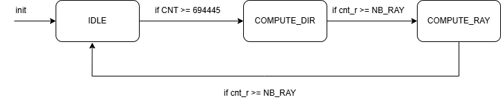
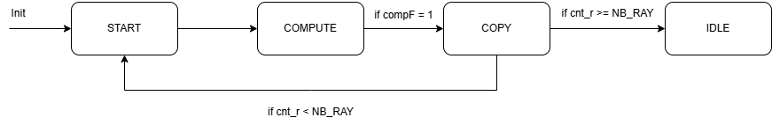
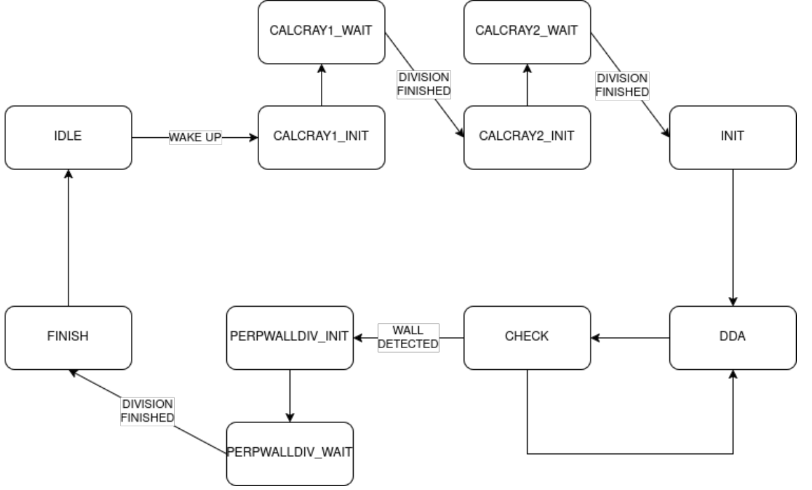
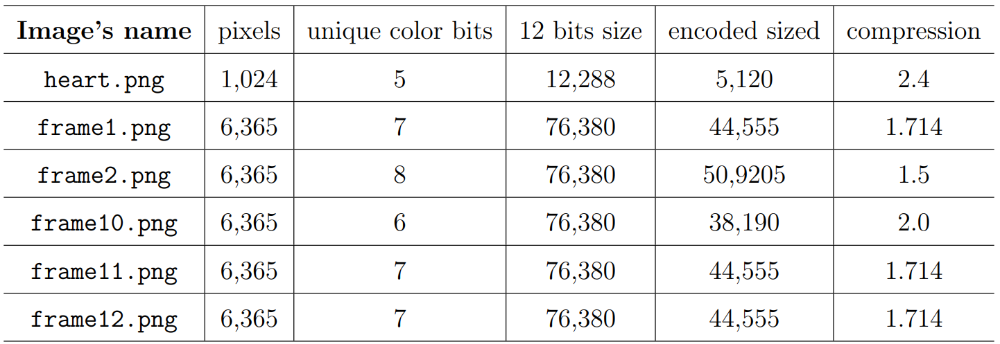

# doom-raycast-fpga

Implementation a retro-like FPV (First Person View) game with 2D dynamics but with a 3D rendering using ray casting engine like in the video game [Wolfenstein3D](https://fr.wikipedia.org/wiki/Wolfenstein)


## Implementation
### - Finite State Machine 
> FSM playing once the `GAME` is launched



> FSM raycasting state once it is in `COMPUTE RAY` state



>  FSM for computation of rays



### - Compresssion of images
RGB images are compressed by looking for the number of unique color in each image which gave us the minimal number of bits needed to encode this image (less than normal 12 bits) and associated LUT for decoding. Saving 112,640 and 166,293 bits on 608,256 bits

> **45.86%** of memory saving




## Structure of repo
> - Q = QuartusPrime 23.1 files
> - .mif = Memory Initialization File
```
├───.qsys_edit      : Q
├───db              : Q
├───greybox_tmp     : Q
│   └───greybox_tmp
├───incremental_db  : Q 
│   └───compiled_partitions
├───mif_files : ASCII files for ROM
├───output_files    : Q
├───png_files : .png for game
├───report
├───ROM : IP component
├───simulation      : Q
│   └───questa
├───test_python : test game in python
├───utils_python : conversion png to mif
└───*.vhd : implemenation file
    *.qpf     : Quartus Project
    *.vhd.bak : Q
    *.qip     : Q
    *.cmp     : Q
```


